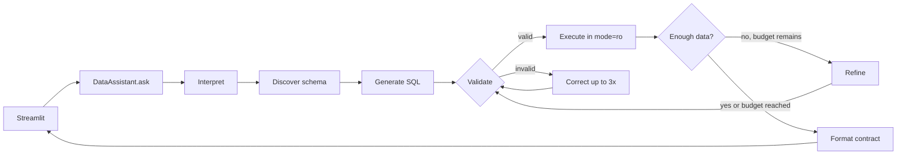

# Virtual Data Assistant — Challenge 1


A natural-language business data assistant for SQLite. It discovers the schema at
runtime, generates and corrects SQL with LangGraph, enforces read-only execution, and
presents auditable results in Streamlit.

[Versão em português](README.md)

## Online evaluation

The public demonstration URL is **https://avaliacao.nalk.com.br**. It will be open
without login or email once server and DNS provisioning is complete. Publication is
still pending that operational step; use the local instructions below until the URL
is live.

The demonstration dataset is fictional. The assistant uses `openrouter/free` with a
shared key and a guarded daily quota. If that quota is exhausted, the UI can request
the visitor's own OpenRouter key (BYOK) for the current session only, after explicit
confirmation. That key is sent to the backend to call the provider and is not
persisted by the application. A dedicated key with a spending limit and/or expiry
is recommended. Tables can be downloaded as CSV and PNG; bar, line, and metric
views as PNG.

## Included

- Explicit graph: interpret → discover schema → generate → validate → execute →
  correct/refine → format.
- OpenRouter through an OpenAI-compatible API; the default is the free router
  `openrouter/free`, which selects an available free model supporting the structured
  outputs used by the agent.
- Dynamic schema metadata, extra columns, foreign keys, and categorical value samples.
- SQLite `mode=ro`, `query_only=ON`, a 200-row cap, query timeout, up to six queries,
  and up to three correction attempts after the initial query.
- `sqlglot` validation: only `SELECT`/`WITH`; writes, multiple statements, `PRAGMA`,
  `ATTACH`, `load_extension`, and cartesian joins are rejected.
- A Brazilian Portuguese Streamlit chat with operational steps, SQL, result samples,
  and safe error states without private chain of thought.
- Table, bar, line, and metric views; local switching without another query; CSV and
  PNG for tables, PNG for other visuals.

## Requirements

- Python 3.11 or newer
- [uv](https://docs.astral.sh/uv/)
- An OpenRouter key for live questions
- The untracked `anexo_desafio_1.db` attachment
- A compatible Chrome or Chromium installation for Kaleido 1.x PNG export

By default, the project reads `../anexo_desafio_1.db`. Set `DB_PATH` before starting
the local process to use another compatible SQLite file. The app always opens it
read-only and never copies it.

## Setup

```powershell
uv sync
Copy-Item .env.example .env
```

Set the local key in `.env`:

```dotenv
OPENROUTER_API_KEY=your-local-key
OPENROUTER_BASE_URL=https://openrouter.ai/api/v1
DB_PATH=../anexo_desafio_1.db
OPENROUTER_FREE_DAILY_REQUEST_LIMIT=45
MAX_SQL_FIX_ATTEMPTS=3
MAX_QUERY_BUDGET=6
```

`.env`, databases, logs, caches, CSVs, and PNGs are ignored by Git. On networks with a
corporate certificate authority, run `uv sync --system-certs`.

The free router still requires an OpenRouter key and is subject to provider limits.
The public flow uses only `openrouter/free`, including BYOK; the router may choose
different models over time. The local quota counts each actual model call, not each
question, and the shared daily limit is configurable. Send only non-sensitive data,
since free providers' policies may differ.

## Validate the attachment

The validator uses `mode=ro` and checks integrity, minimum schema, foreign keys, row
counts, and date ranges. Extra columns are accepted. Differences between denormalized
customer fields and purchase facts are reported as warnings.

```powershell
python scripts/validate_dataset.py --db ..\anexo_desafio_1.db
```

The supplied attachment reports 100 customers, 946 purchases, 273 support records, and
248 campaign records.

## Run

Check provider connectivity first:

```powershell
uv run python scripts/smoke_llm.py
```

Without a key, this command shows an operational message and exits with code 2. With a
configured key, start the UI:

```powershell
uv run streamlit run app.py
```

To change the local source, edit `DB_PATH` in `.env` and restart the app. The public
UI does not accept database paths through the URL. Missing or invalid files produce
an actionable message without creating or overwriting a file.

## Interface

The sidebar shows the source and model and exposes five demo questions. The UI
automatically follows the system light/dark theme; there is no theme selector. The
robot is both favicon and top brand mark, and the loading indicator respects reduced
motion preferences.

Each answer includes:

- `status`: `success`, `empty`, `partial`, or `error`;
- executive text and `warnings`;
- data and a validated visualization with `available_types`;
- an expandable panel with operational steps, queries, corrected errors, and samples;
- downloads supported by the selected view.

If Kaleido cannot render an image, the result remains visible and only the PNG download
shows an operational message. Kaleido 1.x does not bundle a browser. Install
Chrome/Chromium once, or run `uv run plotly_get_chrome` (alternatively,
`uv run kaleido_get_chrome`). If discovery fails, set `BROWSER_PATH` in `.env` to the full
browser executable path. The app never downloads a browser while answering a question.

Verify static export before evaluation:

```powershell
uv run python scripts/smoke_png.py
uv run pytest -m png
```

The smoke check validates real PNG bytes in memory without writing an image file. Tests
marked `png` skip with a clear reason when Chrome is absent; launch failures with an
installed browser remain test failures.

## Docker and deployment

`docker build -t data-assistant:test .` creates a non-root image with Chromium and
runs the PNG smoke check during build. `compose.yaml` mounts the external attachment
read-only and a separate runtime directory; it does not publish port 8501. The
`public` profile connects Cloudflare Tunnel to the internal Compose network.
Environment variables, the Tunnel token, and the database remain outside the image
and Git.

The [deployment runbook](DEPLOYMENT.md) covers DNS inventory, Ubuntu/Debian
provisioning, a dedicated SSH deploy key, GitHub Actions/GHCR, health checks, and
rollback. Remote deployment is enabled only with `PRODUCTION_READY=true` after
server preflight. Do not start the public profile before completing the runbook.

## Architecture



| Module | Responsibility |
|---|---|
| `schema.py` | Introspection and schema DSL with session-scoped caching |
| `validator.py` | LLM-independent AST guardrails |
| `executor.py` | Read-only SQLite connection, row cap, and timeout |
| `llm.py` / `prompts.py` | The only OpenRouter boundary |
| `graph.py` | LangGraph state, nodes, and conditional edges |
| `contract.py` | Pydantic engine-to-UI contract |
| `visualization.py` | Compatibility, fallback, Plotly, and exports |
| `assistant.py` | Public API and operational error handling |

Architecture decisions are captured in ADRs 001–010 in local architecture materials.

## Attachment questions and results

| Question | Expected attachment result | View |
|---|---|---|
| Top five states whose customers purchased through the App in May | São Paulo 6; Minas Gerais 3; Santa Catarina 3; Alagoas 2; Espírito Santo 2 | Bar |
| Customers associated with WhatsApp campaigns in 2024 | 33 distinct customers; 17 interactions (`interagiu=1`); 35 sends | Metric |
| Average purchases per customer by category | Clothing 2.21; Travel 2.16; Books 1.98; Services 1.96; Electronics 1.92; Food 1.88 | Bar |
| Unresolved complaints by channel | Phone 19; Chat 18; Email 14 | Bar |
| Complaint trend by channel | Monthly series from 2024-07 through 2025-07 | Line |

Purchase metrics use the transactional `compras` table. The attachment's
`clientes.valor_total_gasto` and `clientes.data_ultima_compra` fields do not reconcile
with the facts and remain informational only.

## Tests and quality

```powershell
uv run pytest
uv run ruff check .
uv run mypy src/
```

Unit tests cover schema discovery, guardrails, execution, and rendering without simulating
a generated query. The five acceptance questions run exclusively through the real agent:
OpenRouter generates SQL from the runtime-discovered schema. These tests use the `llm`
marker and skip when the key is missing:

```powershell
uv run pytest -m llm
```

## Known limits and next steps

- Streamlit supports independent sessions, but this deployment has one app process;
  horizontal scaling would require coordinated abuse limits.
- The full schema is sent to the model; semantic table selection or schema RAG becomes
  useful for large databases.
- The intentionally small visual menu has four types; filters and composed charts are
  future work.
- Authentication, cross-session memory, conversation persistence, and PDF export are
  outside this MVP.
- Technical Challenge 2 is architecture reference material only and is not an input to
  this application.
