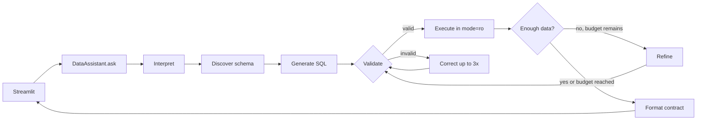

# Virtual Data Assistant — Challenge 1


A natural-language business data assistant for SQLite. It discovers the schema at
runtime, generates and corrects SQL with LangGraph, enforces read-only execution, and
presents auditable results in Streamlit.

[Versão em português](README.md)

## Included

- Explicit graph: interpret → discover schema → generate → validate → execute →
  correct/refine → format.
- OpenRouter through an OpenAI-compatible API; default model
  `google/gemini-2.5-flash`.
- Dynamic schema metadata, extra columns, foreign keys, and categorical value samples.
- SQLite `mode=ro`, `query_only=ON`, a 200-row cap, query timeout, up to six queries,
  and up to three correction attempts after the initial query.
- `sqlglot` validation: only `SELECT`/`WITH`; writes, multiple statements, `PRAGMA`,
  `ATTACH`, `load_extension`, and cartesian joins are rejected.
- A Brazilian Portuguese Streamlit chat with operational steps, SQL, result samples,
  and safe error states without private chain of thought.
- Table, bar, line, and metric views; local switching without another query; CSV and
  PNG for tables, PNG for other visuals.

## Requirements

- Python 3.11 or newer
- [uv](https://docs.astral.sh/uv/)
- An OpenRouter key for live questions
- The untracked `anexo_desafio_1.db` attachment

By default, the project reads `../anexo_desafio_1.db`. Use `DB_PATH` or the `?DB=...`
URL parameter for another compatible SQLite file. The app always opens it read-only and
never copies it.

## Setup

```powershell
uv sync
Copy-Item .env.example .env
```

Set the local key in `.env`:

```dotenv
OPENROUTER_API_KEY=your-local-key
OPENROUTER_MODEL=google/gemini-2.5-flash
OPENROUTER_BASE_URL=https://openrouter.ai/api/v1
DB_PATH=../anexo_desafio_1.db
MAX_SQL_FIX_ATTEMPTS=3
MAX_QUERY_BUDGET=6
```

`.env`, databases, logs, caches, CSVs, and PNGs are ignored by Git. On networks with a
corporate certificate authority, run `uv sync --system-certs`.

## Validate the attachment

The validator uses `mode=ro` and checks integrity, minimum schema, foreign keys, row
counts, and date ranges. Extra columns are accepted. Differences between denormalized
customer fields and purchase facts are reported as warnings.

```powershell
python scripts/validate_dataset.py --db ..\anexo_desafio_1.db
```

The supplied attachment reports 100 customers, 946 purchases, 273 support records, and
248 campaign records.

## Run

Check provider connectivity first:

```powershell
uv run python scripts/smoke_llm.py
```

Without a key, this command shows an operational message and exits with code 2. With a
configured key, start the UI:

```powershell
uv run streamlit run app.py
```

Select another source for one session with a URL such as:

```text
http://localhost:8501/?DB=C:/data/customers.db
```

`DB` takes priority over `DB_PATH`. Missing or invalid files produce an actionable UI
message without creating or overwriting a file.

## Interface

The sidebar shows the source and model, exposes five demo questions, and offers `System`,
`Light`, and `Dark` themes. `System` follows the browser. Overrides update owned surfaces
and charts while native controls preserve Streamlit's theme behavior.

Each answer includes:

- `status`: `success`, `empty`, `partial`, or `error`;
- executive text and `warnings`;
- data and a validated visualization with `available_types`;
- an expandable panel with operational steps, queries, corrected errors, and samples;
- downloads supported by the selected view.

If Kaleido cannot render an image, the result remains visible and only the PNG download
shows an operational message.

## Architecture



| Module | Responsibility |
|---|---|
| `schema.py` | Introspection and schema DSL with session-scoped caching |
| `validator.py` | LLM-independent AST guardrails |
| `executor.py` | Read-only SQLite connection, row cap, and timeout |
| `llm.py` / `prompts.py` | The only OpenRouter boundary |
| `graph.py` | LangGraph state, nodes, and conditional edges |
| `contract.py` | Pydantic engine-to-UI contract |
| `visualization.py` | Compatibility, fallback, Plotly, and exports |
| `assistant.py` | Public API and operational error handling |

Architecture decisions are captured in ADRs 001–008 in the project's architecture
materials.

## Attachment questions and results

| Question | Deterministic reference result | View |
|---|---|---|
| Top five states whose customers purchased through the App in May | São Paulo 6; Minas Gerais 3; Santa Catarina 3; Alagoas 2; Espírito Santo 2 | Bar |
| Customers associated with WhatsApp campaigns in 2024 | 33 distinct customers; 17 interactions (`interagiu=1`); 35 sends | Metric |
| Average purchases per customer by category | Clothing 2.21; Travel 2.16; Books 1.98; Services 1.96; Electronics 1.92; Food 1.88 | Bar |
| Unresolved complaints by channel | Phone 19; Chat 18; Email 14 | Bar |
| Complaint trend by channel | Monthly series from 2024-07 through 2025-07 | Line |

Purchase metrics use the transactional `compras` table. The attachment's
`clientes.valor_total_gasto` and `clientes.data_ultima_compra` fields do not reconcile
with the facts and remain informational only.

## Tests and quality

```powershell
uv run pytest
uv run ruff check .
uv run mypy src/
```

Unit tests and deterministic acceptance tests do not call external services. The five
live tests use the `llm` marker and skip when the key is missing:

```powershell
uv run pytest -m llm
```

## Known limits and next steps

- The Streamlit process is single-user; an HTTP API is a future multi-client extension.
- The full schema is sent to the model; semantic table selection or schema RAG becomes
  useful for large databases.
- The intentionally small visual menu has four types; filters and composed charts are
  future work.
- Authentication, cross-session memory, conversation persistence, and PDF export are
  outside this MVP.
- Technical Challenge 2 is architecture reference material only and is not an input to
  this application.
