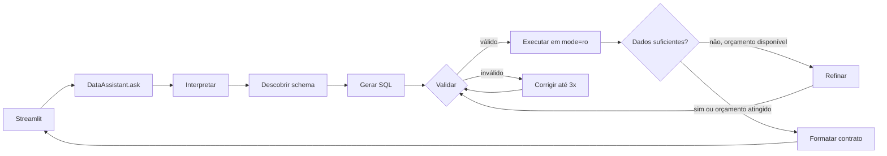

# Assistente Virtual de Dados — Desafio Técnico 1


Assistente em linguagem natural para consultar uma base SQLite. Descobre o schema em
runtime, gera e valida SQL com LangGraph e `sqlglot`, executa consultas somente para
leitura e apresenta resultados com evidências em uma interface Streamlit em pt-BR.

[English version](README.en.md)

## Demonstração pública

A demonstração está publicada em **<https://avaliacao.nalk.com.br>**. A base usada é
fictícia. Não envie dados pessoais, segredos ou informações confidenciais: a pergunta e
o schema necessário à consulta são enviados ao provedor de modelos.

O fluxo público usa o roteador gratuito `openrouter/free`, que pode selecionar modelos
diferentes ao longo do tempo e está sujeito à disponibilidade e aos limites do provedor.
Se não houver chave compartilhada válida ou a cota terminar, a interface pode oferecer
o uso de uma chave OpenRouter própria (BYOK), sempre após confirmação. A chave é usada
somente na sessão atual, enviada ao backend para chamar o provedor e não é gravada em
arquivo ou log. A interface permite limpar a chave da sessão. Prefira uma chave
exclusiva com limite de gastos e/ou validade curta.

## Funcionalidades e requisitos

- **Descoberta dinâmica:** tabelas, colunas, tipos, chaves estrangeiras e amostras de
  valores categóricos são lidos do banco em runtime; as consultas não dependem de um
  schema SQL hardcoded.
- **Consulta segura:** SQLite aberto com `mode=ro` e `PRAGMA query_only=ON`; somente
  `SELECT`/`WITH`; validação da AST com `sqlglot`; comandos de escrita, múltiplos
  statements, `PRAGMA`, `ATTACH`, extensões e joins cartesianos são rejeitados.
- **Limites:** 200 linhas por padrão, timeout, no máximo 6 consultas por pergunta e até
  3 tentativas de correção SQL após a consulta inicial.
- **Fonte de verdade:** métricas de compras são calculadas a partir da tabela
  transacional `compras`. Campos agregados/desnormalizados em `clientes` são apenas
  informativos quando não reconciliam com os fatos.
- **Grafo explícito:** interpretar a pergunta → descobrir schema → gerar SQL → validar
  → executar → corrigir/refinar dentro do orçamento → formatar a resposta.
- **Resposta auditável:** contrato com `status`, `warnings` e `available_types`; mostra
  etapas operacionais, SQL e amostras relevantes, sem expor chain-of-thought privado.
- **Visualizações:** `table`, `bar`, `line` e `metric`; fallback determinístico para
  tabela quando os dados não atendem ao visual solicitado; troca de visual sem nova
  consulta. Tabelas podem ser exportadas em CSV e PNG; os demais visuais, em PNG.
- **Execução interativa:** fases operacionais acessíveis mostram o andamento em tempo
  real. `Parar execução` cancela cooperativamente; uma chamada HTTP já iniciada não é
  encerrada à força, mas seu retorno é descartado e pode ter consumido cota.
- **Resumo por dimensões:** perguntas de quantidade por data e categoria usam `COUNT` e
  `GROUP BY` com o schema descoberto; não contam no frontend apenas linhas brutas limitadas.
  Barras temporais usam períodos em ordem cronológica e séries lado a lado por dimensão.
  Duplicidades ambíguas acionam fallback para tabela com aviso.
- **Interface:** componentes nativos do Streamlit, textos em pt-BR e estilo inspirado em
  Material 3. `System` é o padrão. Use o menu nativo no canto superior direito e escolha
  `Theme` para alternar entre `Light` e `Dark`; essa configuração altera toda a interface,
  incluindo sidebar e controles. As superfícies próprias herdam o tema ativo e os gráficos
  interativos usam o tema do Streamlit; não há seletor de tema dentro do app.

O enunciado especifica `google/gemini-2.5-flash` configurável por
`OPENROUTER_MODEL`. A versão pública atual, porém, fixa `openrouter/free` para os
fluxos de chave compartilhada e BYOK; isso é um desvio de implementação e não garante
um modelo subjacente específico. A configuração usa Python 3.11+, `uv`, LangGraph,
LangChain/OpenAI-compatible client, OpenRouter, SQLite, `sqlglot`, Pydantic,
`python-dotenv`, Streamlit, Plotly, Kaleido, Pytest, Ruff e Mypy.

## Requisitos locais

- Python 3.11 ou superior
- [uv](https://docs.astral.sh/uv/)
- O anexo fictício `anexo_desafio_1.db`, mantido fora do repositório
- Uma chave OpenRouter para chamadas reais ao modelo
- Chrome ou Chromium compatível para exportação PNG com Kaleido 1.x

Por padrão, o processo local lê `../anexo_desafio_1.db`. O aplicativo nunca copia,
altera ou versiona o anexo. Para usar outro SQLite local, configure `DB_PATH` no `.env`.

## Configuração e execução local

No PowerShell, a partir da raiz do repositório:

```powershell
uv sync
Copy-Item .env.example .env
```

Configure a chave local no `.env` e confirme o caminho do banco:

```dotenv
OPENROUTER_API_KEY=sua-chave-local
OPENROUTER_BASE_URL=https://openrouter.ai/api/v1
OPENROUTER_MODEL=openrouter/free
DB_PATH=../anexo_desafio_1.db
```

Mantenha `.env`, chaves, bancos SQLite e seus arquivos WAL/journal, ledger de runtime,
logs, CSVs, PNGs e caches fora do Git. Somente `.env.example` deve representar a
configuração de ambiente versionada.

Os limites de runtime podem ser ajustados no `.env`. Os valores do exemplo são
45 chamadas compartilhadas por dia, 30 segundos por chamada ao provedor, 2000 caracteres
por pergunta, 2 perguntas concorrentes, 5 perguntas por sessão por minuto, até 3
correções SQL e até 6 consultas por pergunta. O ledger agregado de cota fica em
`QUOTA_DB_PATH` (padrão `runtime/quota.sqlite3`), separado do banco de referência.

Valide o anexo antes de iniciar:

```powershell
uv run python scripts/validate_dataset.py --db ..\anexo_desafio_1.db
```

O validador usa acesso somente leitura e verifica integridade, schema mínimo, chaves
estrangeiras, contagens e períodos. Colunas extras são aceitas; divergências entre
campos desnormalizados de clientes e os fatos transacionais aparecem como `WARNING`.
No anexo fornecido, o relatório esperado inclui 100 clientes, 946 compras,
273 atendimentos e 248 registros de campanha.

Opcionalmente, verifique a conexão do provedor. Esse comando faz uma chamada real e
consome cota:

```powershell
uv run python scripts/smoke_llm.py
```

Inicie a interface:

```powershell
uv run streamlit run app.py
```

Abra o endereço local informado pelo Streamlit (por padrão, <http://localhost:8501>).
Se `DB_PATH` estiver ausente ou apontar para um arquivo inválido, a aplicação exibe uma
orientação operacional; não cria nem sobrescreve o banco. Para usar outra base local,
altere `DB_PATH` no `.env` e reinicie. A interface pública não aceita caminhos de banco
pela URL.

## Perguntas de aceite e resultados de referência

Os resultados abaixo correspondem ao anexo fornecido. Outras bases compatíveis podem
produzir resultados diferentes.

| Pergunta | Resultado esperado | Visual |
|---|---|---|
| Quais são os 5 estados com mais clientes que compraram pelo App em maio? | São Paulo 6; Minas Gerais 3; Santa Catarina 3; Alagoas 2; Espírito Santo 2 | Barras |
| Quantos clientes interagiram com campanhas de WhatsApp em 2024? | 33 clientes distintos; 17 interações (`interagiu=1`); 35 envios | Métrica |
| Quais categorias tiveram o maior número de compras em média por cliente? | Roupas 2,21; Viagens 2,16; Livros 1,98; Serviços 1,96; Eletrônicos 1,92; Alimentos 1,88 | Barras |
| Quantas reclamações não resolvidas existem por canal? | Telefone 19; Chat 18; E-mail 14 | Barras |
| Qual foi a tendência mensal de reclamações por canal no último ano? | Série mensal de 2024-07 a 2025-07 no anexo fornecido | Linhas |

## Interface e exportação

Cada resposta pode apresentar:

- `status`: `success`, `empty`, `partial`, `error` ou `cancelled`;
- texto executivo, dados e `warnings`;
- visualização validada e seus `available_types`;
- painel expansível com etapas operacionais, queries executadas, erros corrigidos e
  amostras úteis para conferência.

Falhas produzem mensagens operacionais, sem exibir stack trace cru. O andamento público
mostra somente fases como leitura do schema, validação da consulta e conferência dos
resultados; nunca mostra prompt, token, raciocínio privado ou SQL em edição.

Durante uma pergunta, `Parar execução` impede novas etapas e consultas. O cancelamento é
cooperativo: uma chamada HTTP já enviada pode terminar, seu resultado é descartado e a
interface avisa que a cota pode ter sido consumida. A execução cancelada não apresenta
SQL ou dados parciais como resposta final.

Quando a pergunta pede quantidades por período e categoria, o resultado esperado é uma
linha por combinação com a medida agregada (por exemplo, `Compra | 2024-08-07 | 3`). Se a
primeira consulta trouxer eventos individuais, o grafo tenta refiná-la com `COUNT` e
`GROUP BY`. O frontend não soma silenciosamente uma amostra que pode estar limitada; se a
agregação não puder ser validada ou o orçamento se esgotar, exibe um aviso e oculta as
linhas brutas em vez de tratá-las como a resposta.

Em resultados com período, categoria e medida numérica, selecionar `Barras` posiciona o
período no eixo X e exibe as dimensões lado a lado. Se houver mais de um valor para o mesmo
período/dimensão/medida, o gráfico cai para a tabela e explica que granularidade precisa
ser corrigida.

A troca de visualização usa os dados já carregados e não executa outra consulta. Se os
dados não forem compatíveis com o tipo solicitado, a tabela é o fallback previsível.
Se o Kaleido ou o navegador não conseguir gerar PNG, os dados continuam disponíveis e
a interface informa o problema sem remover o resultado.

Kaleido 1.x não instala navegador. Instale Chrome/Chromium uma vez ou execute:

```powershell
uv run plotly_get_chrome
```

Se o navegador não for detectado, configure `BROWSER_PATH` no `.env` com o caminho
completo do executável. O aplicativo não baixa navegadores enquanto responde.

Verifique a exportação antes da avaliação:

```powershell
uv run python scripts/smoke_png.py
uv run pytest -m png
```

O smoke test valida bytes PNG em memória, sem criar uma imagem no projeto. Testes
marcados `png` são ignorados com motivo explícito quando não há navegador instalado.

## Testes e qualidade

```powershell
uv run pytest
uv run ruff check .
uv run mypy src/
```

Os testes unitários cobrem descoberta do schema, guardrails SQL, execução SQLite,
tratamento de erros, contrato de resposta, visuais, exportação e comportamento da
interface. Os testes das cinco perguntas reais usam o marcador `llm`, precisam do anexo
e de `OPENROUTER_API_KEY`, e fazem chamadas ao provedor:

```powershell
uv run pytest -m llm
```

Execute esse último comando conscientemente, pois pode consumir várias chamadas da cota.
Em redes com autoridade certificadora corporativa, configure a cadeia confiável e use
`uv sync --system-certs`; não desative a validação TLS.

## Docker e publicação

A imagem executa o app como usuário não-root (UID/GID `10001`), inclui Chromium e roda
um smoke test de PNG durante o build. O Compose monta o banco externo somente para
leitura, mantém o ledger em um volume de runtime separado e publica o app apenas em
`127.0.0.1:8501`. No perfil `public`, `cloudflared` usa `network_mode: host` e encaminha
para `http://127.0.0.1:8501`; não exponha a porta do app diretamente à Internet.

Para um preview Docker local no PowerShell:

```powershell
docker compose -f compose.yaml -f compose.local.yaml up -d --build app
```

Abra <http://127.0.0.1:8501>. O override é somente para preview local; não o use no
servidor público. Para parar:

```powershell
docker compose -f compose.yaml -f compose.local.yaml stop app
```

Na implantação Linux, `.env`, banco, `runtime/` e `runtime/tunnel.env` ficam fora da
imagem e do Git. O processo do app precisa conseguir gravar no diretório de runtime
montado em `/app/runtime` para criar o ledger de quota; confira a permissão como o
usuário do container (UID/GID `10001`). Preserve `runtime/tunnel.env` com modo `0600`;
ele contém somente o token do Tunnel e é lido pelo Compose no host.

Exemplo de verificação somente leitura no servidor:

```bash
sudo docker compose exec -T app sh -lc 'id; test -w /app/runtime && echo runtime_writable=YES || echo runtime_writable=NO; test -r /data/source.sqlite3 && echo database_readable=YES || echo database_readable=NO'
```

O [runbook de publicação](DEPLOYMENT.md) descreve o provisionamento, DNS/Cloudflare,
GitHub Actions/GHCR, health checks, proteção dos segredos e rollback.

## Arquitetura



| Módulo | Responsabilidade |
|---|---|
| `schema.py` | Introspecção do schema e amostras de valores de baixa cardinalidade |
| `validator.py` | Guardrails SQL independentes do LLM |
| `executor.py` | SQLite somente leitura, timeout e limite de linhas |
| `llm.py` / `prompts.py` | Fronteira com o OpenRouter |
| `graph.py` | Estado, nós e transições condicionais do LangGraph |
| `contract.py` | Contrato Pydantic entre motor e interface |
| `visualization.py` | Compatibilidade, fallback, Plotly e exportação |
| `assistant.py` | API do assistente, cotas e falhas operacionais |

## Limites conhecidos

- O serviço atual usa um processo Streamlit; escalar horizontalmente requer coordenação
  dos limites e do ledger.
- O schema relevante é enviado ao modelo; não use dados sensíveis.
- As visualizações disponíveis são tabela, barras, linhas e métrica; filtros e gráficos
  compostos não fazem parte desta interface.
- Conversas são mantidas na sessão atual, sem memória persistente entre sessões.
- A seleção `openrouter/free` depende de modelos e limites disponibilizados pelo
  provedor e pode variar com o tempo.
