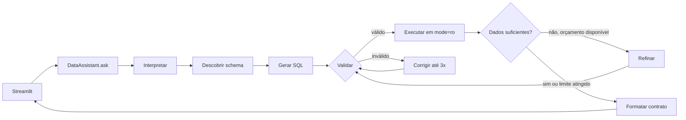

# Assistente Virtual de Dados — Desafio 1


Assistente em linguagem natural para perguntas de negócio sobre um SQLite. O produto
descobre o schema em runtime, gera e corrige SQL com LangGraph, executa somente leitura e
apresenta resultados auditáveis em Streamlit.

[English version](README.en.md)

## O que está incluído

- Grafo explícito: interpretar → descobrir schema → gerar → validar → executar →
  corrigir/refinar → formatar.
- OpenRouter por API compatível com OpenAI; o padrão é o roteador gratuito
  `openrouter/free`, que seleciona um modelo gratuito disponível com suporte às
  saídas estruturadas usadas pelo agente.
- Schema dinâmico com tabelas, colunas extras, chaves estrangeiras e amostras de valores
  categóricos.
- SQLite em `mode=ro`, `query_only=ON`, limite máximo de 200 linhas, timeout, até seis
  queries e até três correções depois da tentativa inicial.
- Validação com `sqlglot`: somente `SELECT`/`WITH`; escrita, múltiplos statements,
  `PRAGMA`, `ATTACH`, `load_extension` e joins cartesianos são rejeitados.
- Chat Streamlit em pt-BR com etapas operacionais, SQL, amostras dos resultados,
  estados de erro e avisos sem chain-of-thought privado.
- Tabela, barras, linha e métrica; troca local sem nova consulta; CSV e PNG para tabelas,
  PNG para os demais visuais.

## Requisitos

- Python 3.11 ou superior
- [uv](https://docs.astral.sh/uv/)
- Chave do OpenRouter para perguntas reais
- O anexo `anexo_desafio_1.db`, mantido fora do repositório

O projeto espera o anexo em `../anexo_desafio_1.db` por padrão. É possível usar outro
SQLite compatível via `DB_PATH` ou pelo parâmetro de URL `?DB=...`. O arquivo é sempre
aberto em modo somente leitura e nunca é copiado pelo aplicativo.

## Configuração

```powershell
uv sync
Copy-Item .env.example .env
```

Preencha apenas a chave no `.env`:

```dotenv
OPENROUTER_API_KEY=sua-chave-local
OPENROUTER_MODEL=openrouter/free
OPENROUTER_BASE_URL=https://openrouter.ai/api/v1
DB_PATH=../anexo_desafio_1.db
MAX_SQL_FIX_ATTEMPTS=3
MAX_QUERY_BUDGET=6
```

O `.env`, bancos, logs, caches, CSVs e PNGs são ignorados pelo Git. Em redes com uma
autoridade certificadora corporativa, execute `uv sync --system-certs`.

O roteador gratuito não cobra por tokens, mas ainda exige uma chave do OpenRouter e está
sujeito aos limites diários do plano gratuito. Como ele pode selecionar modelos diferentes
ao longo do tempo, a resposta pode variar; para comportamento mais estável, é possível
definir no `.env` um modelo gratuito específico depois de validá-lo. Use somente dados sem
informações sensíveis, pois as políticas de retenção dos provedores gratuitos podem variar.

## Validar o anexo

O validador lê o arquivo com `mode=ro`, confirma integridade, schema mínimo, chaves
estrangeiras, contagens e períodos. Colunas extras são aceitas. Divergências entre os
campos denormalizados de `clientes` e os fatos de `compras` aparecem como `WARNING`.

```powershell
python scripts/validate_dataset.py --db ..\anexo_desafio_1.db
```

O relatório esperado para o anexo fornecido contém 100 clientes, 946 compras, 273
atendimentos e 248 registros de campanha.

## Executar

Verifique primeiro a conexão com o provedor:

```powershell
uv run python scripts/smoke_llm.py
```

Sem chave, o script mostra uma mensagem operacional e termina com código 2. Com a chave
configurada, inicie a interface:

```powershell
uv run streamlit run app.py
```

Para selecionar outra fonte apenas nessa sessão, abra uma URL como:

```text
http://localhost:8501/?DB=C:/dados/clientes_completo.db
```

O parâmetro `DB` tem prioridade sobre `DB_PATH`. Caminho ausente ou arquivo inválido gera
uma orientação na interface sem criar ou sobrescrever nada.

## Interface

A barra lateral informa a fonte e o modelo, oferece as cinco perguntas de demonstração e
os temas `System`, `Light` e `Dark`. `System` é o padrão e acompanha o navegador. Os
overrides ajustam as superfícies próprias e os gráficos; os controles nativos preservam a
configuração do Streamlit.

Cada resposta contém:

- `status`: `success`, `empty`, `partial` ou `error`;
- texto executivo e `warnings`;
- dados e visualização validada com `available_types`;
- um painel expansível com etapas operacionais, queries, erros corrigidos e amostras;
- downloads compatíveis com o tipo selecionado.

Se o Kaleido não conseguir gerar a imagem, o resultado continua disponível e somente o
download PNG exibe uma mensagem operacional.

## Arquitetura



| Módulo | Responsabilidade |
|---|---|
| `schema.py` | Introspecção e DSL do schema, com cache limitado à sessão |
| `validator.py` | Guardrails AST independentes do LLM |
| `executor.py` | Conexão SQLite somente leitura, limite e timeout |
| `llm.py` / `prompts.py` | Única fronteira com o OpenRouter |
| `graph.py` | Estado, nós e arestas condicionais do LangGraph |
| `contract.py` | Contrato Pydantic entre motor e interface |
| `visualization.py` | Compatibilidade, fallback, Plotly e exportação |
| `assistant.py` | API pública e tratamento operacional de falhas |

As decisões estão registradas nos ADRs 001–008 do material de arquitetura do projeto.

## Perguntas e resultados do anexo

| Pergunta | Resultado esperado no anexo | Visual |
|---|---|---|
| 5 estados com mais clientes que compraram via App em maio | SP 6; MG 3; SC 3; AL 2; ES 2 | Barras |
| Clientes associados a campanhas WhatsApp em 2024 | 33 clientes distintos; 17 interações (`interagiu=1`); 35 envios | Métrica |
| Média de compras por cliente por categoria | Roupas 2,21; Viagens 2,16; Livros 1,98; Serviços 1,96; Eletrônicos 1,92; Alimentos 1,88 | Barras |
| Reclamações não resolvidas por canal | Telefone 19; Chat 18; E-mail 14 | Barras |
| Tendência de reclamações por canal | Série mensal de 2024-07 a 2025-07 | Linha |

As métricas de compras usam a tabela transacional `compras`. Os campos
`clientes.valor_total_gasto` e `clientes.data_ultima_compra` do anexo não reconciliam com
os fatos e permanecem apenas informativos.

## Testes e qualidade

```powershell
uv run pytest
uv run ruff check .
uv run mypy src/
```

Os testes unitários exercitam schema, guardrails, execução e renderização sem simular uma
query gerada. As cinco perguntas de aceite passam exclusivamente pelo agente real: o SQL é
produzido pelo OpenRouter a partir do schema descoberto em runtime. Esses testes usam o
marcador `llm` e são ignorados quando a chave não existe:

```powershell
uv run pytest -m llm
```

## Limites conhecidos e próximos passos

- O fluxo é single-user e roda no mesmo processo do Streamlit; uma API HTTP fica como
  evolução para múltiplos clientes.
- A descoberta envia o schema completo ao modelo; seleção semântica de tabelas ou RAG
  passa a ser útil em bancos grandes.
- O cardápio visual cobre quatro tipos intencionalmente simples; filtros e gráficos
  compostos ficam para uma evolução.
- Autenticação, memória entre sessões, persistência de conversas e exportação PDF estão
  fora deste MVP.
- O Desafio Técnico 2 possui somente arquitetura de referência e não é entrada deste
  aplicativo.
