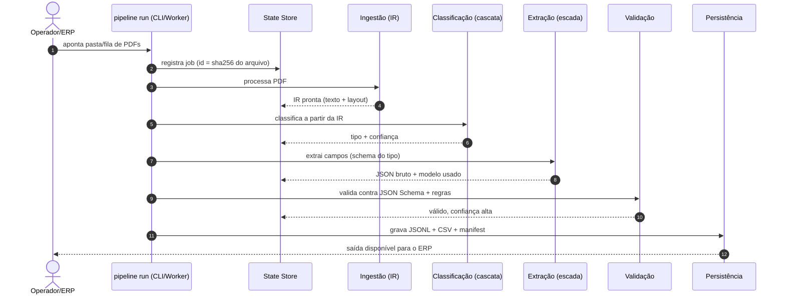
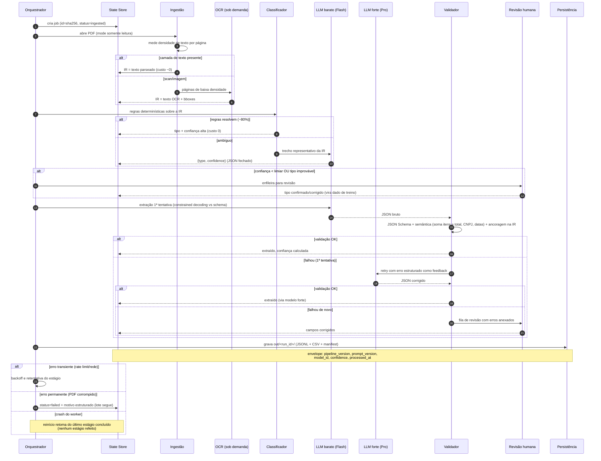
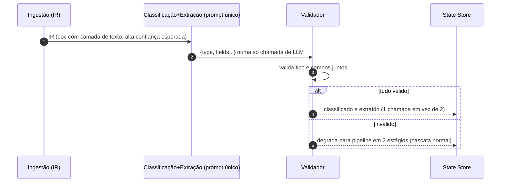

# Diagramas de Sequência — Pipeline de Documentos (Desafio 2)

> Material de apoio para a entrevista técnica. Dois níveis: o fluxo feliz simplificado
> (explicação de abertura) e o fluxo completo com todos os desvios (aprofundamento).

---

## 1. Fluxo feliz simplificado (visão de abertura)

**Narração de 30 segundos:** cada documento é um job idempotente indexado pelo hash do
arquivo. Ele atravessa cinco estágios — ingestão com representação intermediária,
classificação em cascata, extração com escada de modelos, validação contra schema e
persistência versionada. O state store registra cada transição, então qualquer falha é
isolada, retomável e auditável.

---

## 2. Fluxo completo com desvios (aprofundamento)

**Pontos para destacar ao explicar:**

1. **Todo LLM tem saída validada por máquina** — o modelo nunca é a última palavra:
   schema, regras semânticas e ancoragem na IR antecedem qualquer aceite (trecho da
   extração até a persistência).
2. **A cascata só paga o modelo caro quando vale** — regras resolvem ~80% da
   classificação (primeiro `alt` do classificador) e o modelo forte só entra no retry
   da extração (segundo `alt` do validador).
3. **Falha tem três destinos, nunca um quarto** — retentativa (transiente), fila de
   revisão (incerto) ou `failed` estruturado (permanente); o lote nunca para.
4. **O state store é a espinha dorsal** — cada seta `-->>SS` é um checkpoint: é ele que
   transforma "script que processa arquivos" em "pipeline reprodutível e retomável".

---

## 3. Versão alternativa: fusão de estágios (pergunta provável)

Se perguntarem "e se você quiser reduzir ainda mais o custo?":

A tese: o pipeline em estágios separados é o caminho **robusto padrão**; a fusão é uma
otimização **opcional e degradável** para o subconjunto fácil — nunca o contrário.
