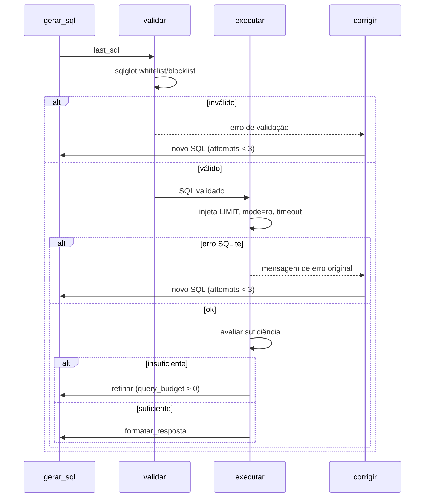

# Design: implement-data-assistant

## Arquitetura

```
┌─────────────────────────────────────────────────────────────┐
│ Streamlit (app.py)                    chat + raciocínio UI  │
│   session_state: histórico, estado do último grafo          │
└──────────────────────────────┬──────────────────────────────┘
                               │ import direto (in-proc)
┌──────────────────────────────▼──────────────────────────────┐
│ data_assistant (pacote Python)                              │
│  ┌────────────────────────────────────────────────────────┐ │
│  │ graph.py — LangGraph                                   │ │
│  │   interpretar → descobrir_schema → gerar_sql →         │ │
│  │   validar → executar → corrigir/refinar → formatar     │ │
│  └────────────────────────────────────────────────────────┘ │
│   executor.py (sqlite mode=ro)   validator.py (sqlglot)     │
│   schema.py (introspecção)       llm.py (OpenRouter)        │
│   prompts.py                     contract.py (Pydantic)     │
└──────────────────────────────┬──────────────────────────────┘
                               │ sqlite3
                        ┌──────▼──────┐
                        │ anexo_      │
                        │ desafio_1.db│
                        └─────────────┘
```

## Dataset de referência e resolução do caminho

O anexo local `anexo_desafio_1.db` é a fonte de integração para desenvolvimento e
aceitação. Ele contém as quatro tabelas do enunciado, mas a tabela `clientes` também
possui `valor_total_gasto` e `data_ultima_compra`; essas colunas extras são intencionais
e não podem ser removidas nem incorporadas como schema fixo no código.

Perfil observado no anexo, usado apenas como contrato de teste local:

| Tabela | Linhas | Observação |
|---|---:|---|
| `clientes` | 100 | 100 clientes referenciados |
| `compras` | 946 | datas entre 2024-07 e 2025-07 |
| `suporte` | 273 | 90 clientes com atendimento |
| `campanhas_marketing` | 248 | datas entre 2024-07 e 2025-07 |

Auditoria do anexo: `PRAGMA integrity_check`, `quick_check` e `foreign_key_check`
passam; não há nulos, datas inválidas, valores monetários negativos, booleanos fora de
0/1, emails inválidos ou duplicidades exatas. Contudo, os campos denormalizados
`clientes.valor_total_gasto` e `clientes.data_ultima_compra` não reconciliam com
`compras`: há divergência nos 100 clientes, com 90 datas anteriores e 10 posteriores à
última compra registrada. Eles devem ser tratados como campos informativos do anexo,
não como fonte de verdade para métricas operacionais. O motor não deve alterar esses
dados; para perguntas de compras, deve priorizar a tabela `compras`.

O motor resolve a fonte nesta ordem: parâmetro de runtime `DB`, variável `DB_PATH` e
default local `../anexo_desafio_1.db` durante o desenvolvimento atual. O caminho deve ser validado, aberto com URI
`mode=ro`, com `PRAGMA query_only=ON` e `PRAGMA foreign_keys=ON`, e exibido na interface
sem expor credenciais. Um banco compatível pode ter linhas, datas ou colunas extras
diferentes; os testes que dependem de valores exatos devem ser marcados como integração
do anexo, nunca tratados como regra do motor.

## Repositório e fluxo de desenvolvimento

O código vive em `assistente-virtual-dados-desafio-1/`, que é um repositório Git
independente dentro do workspace de planejamento. A branch permanente é `main`.
Cada task de implementação deve usar uma branch curta derivada de `main`, por exemplo
`feat/t2-schema` ou `fix/t4-validator`; a task só é considerada concluída depois de
verificação, commit convencional e merge em `main`. A branch de trabalho deve ser
removida após o merge, salvo necessidade de revisão.

Credenciais e configuração local vivem no `.env` na raiz do repositório. O `.env` nunca é
versionado; somente `.env.example` entra no Git. O banco e artefatos gerados também são
ignorados. O anexo atual fica fora do repositório em `../anexo_desafio_1.db`, apontado
por `DB_PATH`, mas qualquer caminho compatível pode ser usado.

## AgentState (TypedDict)

| Campo | Tipo | Descrição |
|---|---|---|
| `question` | `str` | Pergunta original do usuário |
| `format_hint` | `str \| None` | Pedido explícito de formato ("gráfico de barras") |
| `schema` | `str` | DSL textual do schema descoberto |
| `steps` | `list[dict]` | Trilha de raciocínio p/ UI: `{node, detail, sql?, error?, rows?}` |
| `queries` | `list[str]` | Todas as queries executadas |
| `last_sql` | `str` | Última query gerada |
| `last_result` | `list[dict] \| None` | Resultado da última query |
| `last_error` | `str \| None` | Último erro de execução/validação |
| `sql_fix_attempts` | `int` | Tentativas de correção usadas (máx 3) |
| `query_budget` | `int` | Consultas restantes (máx 6) |
| `sufficient` | `bool` | Dados suficientes para responder? |
| `response` | `AssistantAnswer` | Contrato final (ver abaixo) |

## Contrato de saída (Pydantic)

```python
class Visualization(BaseModel):
    type: Literal["line", "bar", "table", "metric"]
    title: str
    x: str | None = None
    y: list[str] | None = None
    group: str | None = None
    available_types: list[Literal["line", "bar", "table", "metric"]]

class AssistantAnswer(BaseModel):
    status: Literal["success", "empty", "partial", "error"]
    response: str
    visualization: Visualization
    queries: list[str]
    steps: list[dict]
    warnings: list[str]
```

O frontend valida contra o contrato; qualquer violação → fallback `table` (ADR-006).
`available_types` é calculado pelo motor/renderizador a partir das colunas e do tipo dos
dados, não é confiado ao LLM.

## Frontend: Material 3 aplicado ao Streamlit

O usuário principal é um CTO avaliando a solução em uma sessão desktop. A experiência
deve priorizar confiança, legibilidade e inspeção técnica, com uma ação central:
perguntar, entender a resposta e conferir as evidências.

### Estrutura visual

- Sidebar: identidade do assistente, status do banco, modelo ativo, tema e perguntas de
  exemplo.
- Área principal: histórico de chat e resposta atual.
- Resposta: texto, visualização, avisos e ações de exportação.
- Expander de evidências: etapas, queries, erros corrigidos, tempo e amostra de linhas.
- Campo de pergunta persistente no rodapé da conversa.

### Tema e linguagem visual

Material 3 será usado como linguagem visual, com componentes nativos do Streamlit e uma
camada mínima de tokens CSS, sem uma aplicação React paralela. O modo padrão é `System`;
`Light` e `Dark` ficam disponíveis como overrides da sessão. A implementação deve usar
cores semânticas para superfície, texto, foco, sucesso, aviso e erro, mantendo contraste
WCAG AA. O tema do gráfico deve acompanhar o tema ativo.

O registro visual é **restrained**, inspirado em Material 3, Google Cloud Console e Looker
Studio: superfícies neutras, azul Material como ação primária e cor reservada para estados
e dados. A cena de uso é um CTO em uma avaliação técnica, diante de uma tela desktop bem
iluminada, alternando entre a conclusão executiva e as evidências SQL; a interface deve
transmitir controle e confiança, não entretenimento.

Quando a versão do Streamlit não permitir detectar ou alternar o tema do sistema de forma
confiável, a interface deve preservar a configuração nativa do Streamlit e informar o
override disponível, sem aplicar hacks frágeis sobre classes internas.

### Visualização e exportação

O usuário pode alternar entre os tipos disponíveis sem executar novamente a pergunta:

| Tipo | Quando disponível | Exportação |
|---|---|---|
| Tabela | Sempre que houver linhas/colunas | CSV e PNG |
| Barras | Uma dimensão categórica + métrica | PNG |
| Linha | Dimensão temporal + métrica | PNG |
| Métrica | Resultado escalar ou KPI | PNG |

Plotly será o renderer único dos gráficos e da imagem de tabela; Kaleido será usado para
gerar PNG. `st.download_button` entrega os arquivos. Se o renderer de imagem não estiver
disponível, o resultado continua visível e a exportação exibe erro operacional claro.

### Estados de interface

O contrato precisa suportar `success`, `empty`, `partial` e `error`, além de `warnings`.
Esses estados cobrem: primeira abertura, carregamento, resultado vazio, banco ausente,
chave LLM ausente, erro corrigido, orçamento esgotado e resposta parcial. Nenhum estado
de erro deve mostrar stack trace cru.

### Idioma e formatação

A interface e as mensagens são `pt-BR`; SQL, nomes de tabelas e nomes de colunas permanecem
no formato original para facilitar a auditoria técnica. Valores exibidos na UI usam
formatação local de números e datas, enquanto os arquivos exportados preservam formato
machine-readable (UTF-8 e datas ISO) para evitar perda de precisão ou ambiguidade.

### Fora do MVP de frontend

Autenticação, persistência entre sessões, API HTTP, exportação PDF, filtros avançados,
edição livre de gráficos e suporte ao Desafio 2 permanecem fora do escopo.

## Decisões-chave (referências)

| Decisão | ADR |
|---|---|
| LangGraph com ciclo correção/refinamento | ADR-001 |
| OpenRouter compatível OpenAI, modelo por env var | ADR-002 |
| mode=ro + sqlglot + LIMIT + orçamentos | ADR-003 |
| Introspecção runtime + amostragem categórica | ADR-004 |
| Feedback de erro real do SQLite no prompt de correção | ADR-005 |
| Cardápio fechado de visuais + fallback | ADR-006 |
| Streamlit in-proc com painel de raciocínio | ADR-007 |
| Material 3, renderer único e exportação | ADR-008 |

## Sequência do ciclo de correção



## Pontos de extensão

- `llm.py` isola o client — trocar provedor não toca no grafo.
- `executor.py` é a única fronteira com sqlite3 — testável com bancos fixture.
- `contract.py` versiona o contrato motor→UI.

## Regras semânticas cobertas pelo conjunto de perguntas

- Quando a pergunta usa apenas o nome de um mês, sem ano, a consulta considera todos os
  anos presentes no banco e informa o período considerado na resposta.
- "Clientes que interagiram" significa clientes distintos (`COUNT(DISTINCT cliente_id)`)
  com `interagiu = 1`; não significa quantidade de envios ou soma de interações.
- "Média de compras por cliente" exige agregação por categoria e cliente antes da média,
  evitando que clientes com muitos registros distorçam a interpretação.
- O resultado final deve declarar quando não há registros no período solicitado; vazio
  não pode ser convertido em zero sem justificativa.

## Valores de referência para aceitação local

Os valores abaixo são um contrato do arquivo anexado, não regras do agente. Eles permitem
detectar regressões na integração sem chamar o LLM:

| Pergunta | Resultado esperado no anexo |
|---|---|
| 5 estados com mais clientes que compraram via App em maio | São Paulo (6), Minas Gerais (3), Santa Catarina (3), Alagoas (2), Espírito Santo (2) |
| Clientes que interagiram com WhatsApp em 2024 | 33 clientes distintos; 17 interações em 35 envios |
| Média de compras por cliente por categoria | Roupas (2,21), Viagens (2,16), Livros (1,98), Serviços (1,96), Eletrônicos (1,92), Alimentos (1,88) |
| Reclamações não resolvidas por canal | Telefone (19), Chat (18), E-mail (14), filtrando `tipo_contato = Reclamação` |
| Tendência de reclamações por canal | Série mensal de 2024-07 a 2025-07, filtrando `tipo_contato = Reclamação` |

## Trade-offs deliberados

- **In-proc Streamlit, sem API HTTP:** escopo single-user; extração de API fica como
  melhoria documentada.
- **Sem RAG de schema:** 4 tabelas cabem no prompt; RAG é melhoria para muitos schemas.
- **Orçamentos fixos (3 correções, 6 queries):** comportamento determinístico de falha,
  testável; tunáveis por env var.
- **Anexo fora do versionamento:** o arquivo fornecido é usado localmente por
  `DB_PATH`; testes unitários criam bancos temporários mínimos e não dependem do binário.
